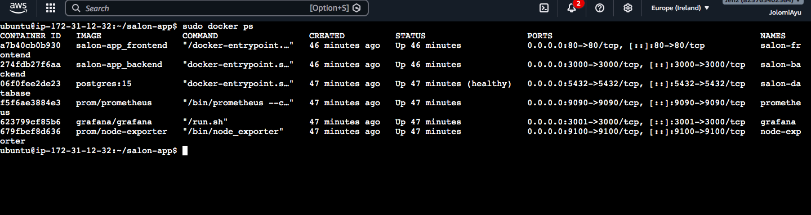
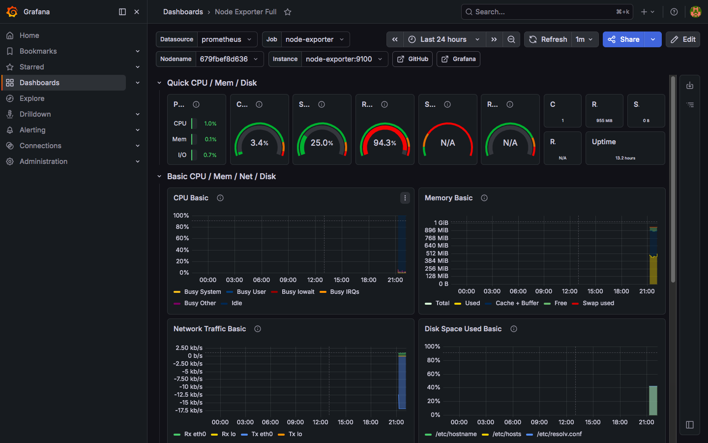
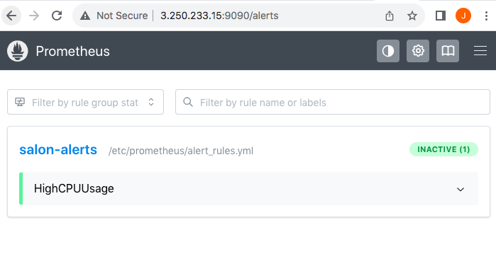
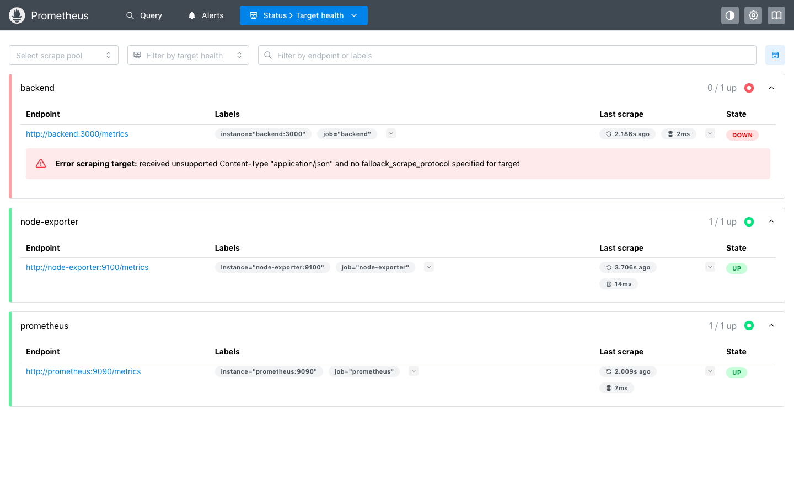
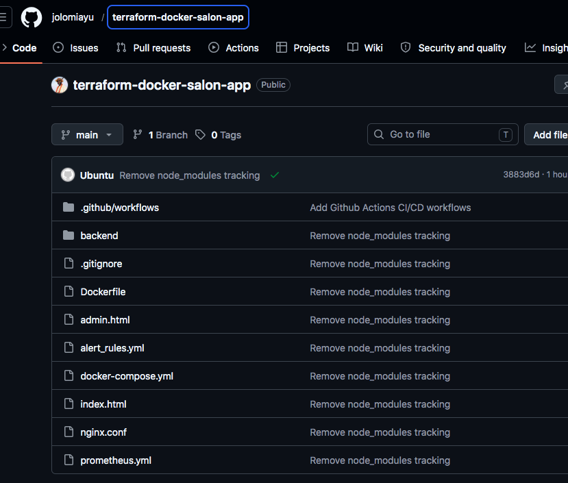

# Terraform Docker Salon App

A production-style cloud-native salon booking platform deployed on AWS using Docker, Terraform, GitHub Actions CI/CD, Prometheus, Grafana, and PostgreSQL.

---

# Project Overview

This project demonstrates a real-world DevOps and Cloud Engineering workflow by deploying a containerized salon booking application on AWS EC2 with infrastructure automation, monitoring, alerting, and CI/CD integration.

The platform allows users to:

- Book salon appointments
- Store booking data in PostgreSQL
- Access an admin login page
- Monitor infrastructure and containers using Grafana and Prometheus

---

# Tech Stack

- AWS EC2
- Terraform
- Docker
- Docker Compose
- PostgreSQL
- Nginx
- Prometheus
- Grafana
- Node Exporter
- GitHub Actions CI/CD
- HTML
- JavaScript
- Node.js

---

# Infrastructure Features

- Infrastructure provisioning with Terraform
- Dockerized frontend and backend services
- PostgreSQL persistent database storage
- Nginx reverse proxy configuration
- Prometheus monitoring stack
- Grafana dashboards
- Node Exporter server metrics
- Prometheus alert rules
- GitHub Actions automated deployment pipeline
- Environment variable management with .env
- Docker Compose health checks
- EC2 EBS storage expansion from 8GB to 20GB

---

# Monitoring & Alerting

The monitoring stack includes:

- Prometheus metrics collection
- Grafana visualization dashboards
- Node Exporter system metrics
- Backend availability monitoring
- CPU usage alerting

---

# CI/CD Workflow

GitHub Actions automatically:

- Connects to the EC2 instance
- Pulls latest repository changes
- Rebuilds Docker containers
- Restarts application services

---

# Project Architecture

User → Nginx → Frontend → Backend API → PostgreSQL

Monitoring Flow:

Prometheus → Grafana Dashboard  
Node Exporter → Prometheus

---

# Screenshots

## Main Booking Platform

---

## Admin Login

---

## Docker Containers Running

---

## Grafana Monitoring Dashboard

---

## Prometheus Alerts

---

## Prometheus Target Health

---

## GitHub Repository

---

# Future Improvements

- HTTPS with Let's Encrypt
- Load Balancer deployment
- Kubernetes migration
- AWS ECS/EKS deployment
- Centralized logging stack
- Automated backup strategy
- Terraform remote state management

---

# Author

Jolomi Ayu

Cloud / DevOps Engineering Project
